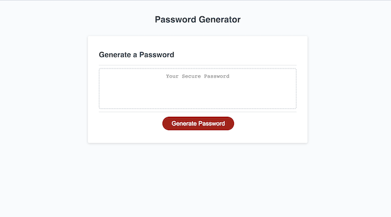
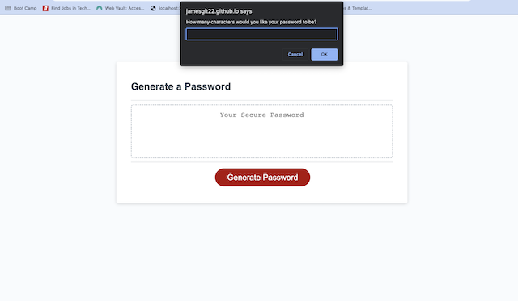
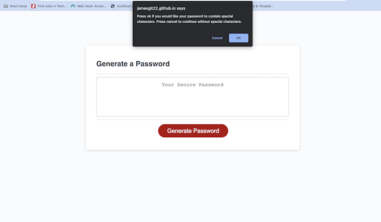
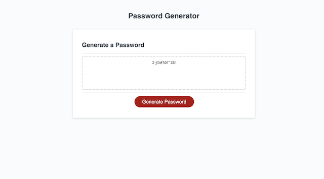

# Password-Generator

  

  ## Description:
        
  This is a front end application that allows the user to create a randomized password that meets the criteria of the parameters the user specifies.
    
  ---
  
  ## Table of Contents:
    
  - [Instillation](#instillation)
  - [Usage](#usage)
  - [ScreenShots](#screenshots)
  - [License](#license)
  - [Questions](#questions)
  
  ## Instillation:
  
  You can use the live site [here](https://jamesgit22.github.io/Password-Generator/), or clone the code from the [github repository](https://github.com/Jamesgit22/Password-Generator) to your local machine.
  
  ## Usage:
  
  You can use this project to quickly generate secure passwords based on specific criteria.
  
  ## ScreenShots:
  
  

  

  

  

  
  ## License:
  
  This project uses the [MIT](https://opensource.org/licenses/MIT) license.

  ---
  
  ## Questions:

  Please feel free to get in contact if you have any questions about this project.

  - Github: [Jamesgit22](https://github.com/Jamesgit22)
  - Email: jschroeder2296@gmail.com